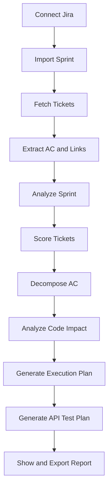
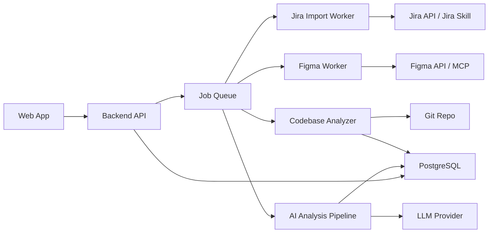

# ScopePilot SaaS 实施方案

## 1. 产品定位

### 1.1 产品名称

暂定名称：**ScopePilot**

### 1.2 一句话定位

**面向后端开发者和后端团队的 AI 迭代需求分析与执行计划平台。**

平台从 Jira Sprint 中读取需求 ticket，结合 Acceptance Criteria、Figma 原型和项目代码库上下文，自动生成后端开发执行计划、风险分析、功能拆解和 API 测试计划。

### 1.3 核心价值

后端开发者在每个迭代开始前，通常需要完成以下工作：

- 阅读 Jira ticket。
- 理解业务目标和 Acceptance Criteria。
- 评估复杂度和风险。
- 找出需求不清晰的问题。
- 判断需要新增或修改哪些 API、DB、权限、状态流、校验逻辑。
- 结合现有项目代码制定开发计划。
- 编写或准备 API 测试用例。

ScopePilot 的目标不是直接替代开发者写代码，而是把“需求理解、风险识别、后端拆解、开发计划、API 测试准备”自动化。

### 1.4 推荐市场定位

不要定位为：

> AI 自动写代码工具

更推荐定位为：

> AI Sprint Requirement Analyst for Backend Teams

也就是：

> 帮后端团队在迭代开始前，把 Jira 需求看清楚、风险找出来、开发计划列出来、API 测试准备好。

这个定位更容易与 GitHub Copilot、Atlassian Rovo Dev、OpenHands 等 coding agent 区分开。

## 2. 目标用户

### 2.1 第一优先级用户

- 后端开发者。
- Tech Lead。
- 后端小团队。
- 需要频繁处理 Jira Sprint 的外包团队或项目交付团队。

### 2.2 第二优先级用户

- QA 工程师。
- Scrum Master。
- 产品经理。
- 研发经理。

### 2.3 典型用户场景

用户输入：

```text
Sprint: LPRO Sprint 0707
Codebase: 当前后端项目
```

平台输出：

- 本迭代需求总览。
- 每个 ticket 的复杂度评分。
- 每个 ticket 的风险点和待确认问题。
- 根据 AC 拆解出的后端功能点。
- 可能涉及的 API、数据库、权限、状态流、校验逻辑。
- 结合项目代码结构生成的开发步骤。
- API 测试场景和边界用例。
- 平台内可查看、筛选、导出和分享的分析结果。

## 3. 产品边界

### 3.1 MVP 要做

- 支持输入 Jira Sprint 名称或 JQL。
- 拉取 Sprint 中的所有 Jira ticket。
- 解析 ticket 描述、AC、附件、Figma 链接。
- 对每个 ticket 做需求摘要。
- 对每个 ticket 做复杂度和风险评分。
- 从 AC 中拆解后端功能点。
- 结合代码库结构推断影响模块。
- 生成开发执行计划。
- 生成 API 测试计划。
- 支持平台内展示分析结果。
- 支持导出 Markdown / PDF。
- 支持中英文界面和中英文报告输出。

### 3.2 MVP 暂不做

- 不自动修改代码。
- 不自动提交 PR。
- 不做 Jira 替代品。
- 不做完整项目管理系统。
- 不做复杂 Figma-to-code。
- 不做前端代码生成。
- 不做完整自动化测试执行平台。
- 不把分析结果自动回写到 Jira comment。

### 3.3 后续可扩展

- 自动生成 OpenAPI 测试集合。
- 导出 Postman Collection。
- 集成 GitHub/GitLab Pull Request。
- 接入 coding agent 执行部分代码修改。
- 支持私有部署。
- 支持团队知识库和历史迭代复盘。

### 3.4 本地代码库接入策略

纯 Web SaaS 不能直接读取用户电脑上的任意本地目录，这是浏览器安全限制。因此 Codebase 接入建议支持两种模式：

1. **云端仓库模式**
   - 用户连接 GitHub、GitLab、Bitbucket 等代码仓库。
   - 平台通过 OAuth 或 App 安装读取代码。
   - 适合团队 SaaS 场景。

2. **本地项目模式**
   - 用户安装 ScopePilot Local Agent 或使用 CLI。
   - 用户在本地选择项目目录。
   - Local Agent 在本地扫描代码结构、API、OpenAPI、数据库 migration。
   - 默认只上传代码索引摘要、文件路径、符号名、接口定义和结构化上下文，不上传完整源码。
   - 企业版可支持完全本地分析或私有部署。

本地项目模式的推荐命令：

```bash
scopepilot connect-local "F:\Projects\backend-service"
```

### 3.5 国际化要求

平台从第一版开始支持中英文两个版本：

- UI 支持中文和英文切换。
- 报告支持中文和英文输出。
- Ticket 原文可以是中文、英文或中英混合。
- AI 分析语言默认跟随 workspace 设置，也允许单次分析时选择。
- 数据库中保存结构化字段，不依赖某一种自然语言文本。

## 4. 产品模块

### 4.1 Sprint Import

功能：

- 输入 Jira Sprint 名称、Board、Project 或 JQL。
- 调用已有 Jira Skill 或 Jira API 获取 ticket。
- 展示 ticket 列表。
- 识别 ticket 类型、状态、负责人、Story Points、优先级。
- 提取 ticket 中的 AC、描述、附件、Figma 链接、Confluence 链接。

输出：

```json
{
  "sprint": "LPRO Sprint 0707",
  "tickets": [
    {
      "key": "LPRO-123",
      "summary": "用户可以导出订单列表",
      "description": "...",
      "acceptance_criteria": ["..."],
      "figma_links": ["..."],
      "status": "To Do",
      "story_points": 3
    }
  ]
}
```

### 4.2 Sprint Analyzer

功能：

- 汇总整个 Sprint 的业务目标。
- 识别跨 ticket 依赖。
- 识别高风险 ticket。
- 识别需求不清晰或 AC 不完整的 ticket。
- 生成迭代级别的风险报告。

输出：

- Sprint Summary。
- Sprint Risk Map。
- Open Questions。
- Suggested Execution Order。

### 4.3 Ticket Scorer

评分维度：

- 业务复杂度。
- 技术复杂度。
- 代码影响范围。
- 外部依赖。
- 数据库改动风险。
- 权限和安全风险。
- 状态流复杂度。
- API 测试成本。
- 需求不确定性。

示例输出：

```json
{
  "ticket": "LPRO-123",
  "score": {
    "business_complexity": 2,
    "technical_complexity": 3,
    "code_impact": 3,
    "dependency_risk": 2,
    "test_cost": 3,
    "uncertainty": 2,
    "overall": 3
  },
  "estimated_effort": "1-2 days",
  "risk_level": "medium"
}
```

### 4.4 AC Decomposer

功能：

- 读取 Acceptance Criteria。
- 拆解成后端功能点。
- 判断每条 AC 是否可测试。
- 识别 AC 中隐含的接口、权限、状态、校验和数据要求。

示例：

```text
AC:
- 用户可以根据订单状态筛选订单。
- 用户可以导出筛选后的订单列表。
- 没有导出权限的用户不能导出。
```

拆解结果：

```json
{
  "backend_features": [
    "订单列表查询支持 status 筛选",
    "新增订单导出 API",
    "导出逻辑复用订单筛选条件",
    "增加订单导出权限校验"
  ],
  "api_candidates": [
    "GET /orders",
    "GET /orders/export"
  ],
  "permission_rules": [
    "需要订单导出权限"
  ],
  "testable_criteria": [
    "有权限用户导出成功",
    "无权限用户返回 403",
    "筛选条件影响导出结果"
  ]
}
```

### 4.5 Figma Interpreter

MVP 阶段不要做复杂设计理解，先做后端视角的提取。

功能：

- 从 ticket 中识别 Figma 链接。
- 读取或展示 Figma 页面信息。
- 提取页面中的字段、按钮、列表、筛选条件、状态、弹窗、表单。
- 推断后端接口需求。

重点提取：

- 表单字段。
- 必填项。
- 枚举值。
- 列表筛选条件。
- 表格列。
- 操作按钮。
- 状态变化。
- 权限入口。
- 批量操作。
- 导入/导出。

输出：

```json
{
  "figma_signals": {
    "forms": ["创建订单表单"],
    "fields": ["订单名称", "客户", "状态", "金额"],
    "actions": ["保存", "提交审批", "导出"],
    "filters": ["状态", "创建时间", "客户"],
    "backend_implications": [
      "需要订单创建 API",
      "订单列表需要支持多条件筛选",
      "提交审批可能涉及状态流转",
      "导出功能需要权限控制"
    ]
  }
}
```

### 4.6 Codebase Impact Analyzer

功能：

- 扫描后端项目结构。
- 支持云端仓库和本地项目两种接入方式。
- 识别 controller、service、repository、entity、migration、OpenAPI 文件。
- 根据 ticket 语义和代码命名推断可能影响模块。
- 生成开发者可审查的影响范围。

本地项目接入方式：

- Web 平台负责展示分析结果和任务状态。
- Local Agent 负责在用户电脑上选择目录并扫描项目。
- Local Agent 将代码索引摘要同步到 SaaS 平台。
- 默认不上传完整源码，降低隐私风险。
- 用户可以在项目设置中选择“云端仓库”或“本地项目”。

第一阶段可以使用简单规则：

- 文件名和类名匹配。
- API route 匹配。
- OpenAPI path 匹配。
- 数据库表名匹配。
- controller/service/repository 分层识别。

后续再增强：

- embedding 语义检索。
- 调用图分析。
- 依赖分析。
- 历史 ticket 与 commit 关联。

输出：

```json
{
  "code_impact": {
    "likely_modules": [
      "OrderController",
      "OrderService",
      "OrderRepository",
      "PermissionService"
    ],
    "likely_files": [
      "src/order/order.controller.ts",
      "src/order/order.service.ts",
      "src/order/order.repository.ts"
    ],
    "database_impact": [
      "orders table"
    ],
    "confidence": "medium"
  }
}
```

### 4.7 Execution Plan Generator

功能：

- 将 ticket 分析结果转成开发步骤。
- 每个步骤都要具体、可执行、可验证。
- 输出开发前需要确认的问题。
- 输出建议执行顺序。

示例：

```json
{
  "implementation_plan": [
    "确认订单导出字段和最大导出数量",
    "检查现有订单查询 API 是否已支持 status、customer、date range 筛选",
    "新增 GET /orders/export API",
    "复用订单查询条件构建导出数据集",
    "增加订单导出权限校验",
    "实现 CSV 文件生成逻辑",
    "补充导出失败场景处理",
    "准备 API 测试用例"
  ],
  "open_questions": [
    "导出字段是否固定？",
    "导出是否需要异步任务？",
    "最大导出数量是多少？"
  ]
}
```

### 4.8 API Test Planner

功能：

- 根据 AC、API 候选、权限、边界条件生成测试计划。
- 支持导出 Markdown。
- 后续支持导出 Postman Collection、pytest/httpx、REST Assured、Schemathesis 配置。

测试维度：

- 正常场景。
- 异常参数。
- 权限不足。
- 资源不存在。
- 状态不允许。
- 边界值。
- 并发或重复提交。
- 外部服务失败。

输出：

```json
{
  "api_tests": [
    {
      "name": "有权限用户导出订单成功",
      "method": "GET",
      "path": "/orders/export",
      "expected_status": 200,
      "assertions": [
        "响应 Content-Type 为 text/csv",
        "导出内容符合筛选条件"
      ]
    },
    {
      "name": "无权限用户导出订单失败",
      "method": "GET",
      "path": "/orders/export",
      "expected_status": 403
    }
  ]
}
```

## 5. 推荐 SaaS 信息架构

### 5.1 页面结构

```text
Workspace
  Projects
    Project Detail
      Integrations
      Codebase Settings
      API Schema
      Sprints
        Sprint Detail
          Overview
          Tickets
          Risk Map
          Execution Plan
          API Test Plan
          Open Questions
```

### 5.2 MVP 页面

第一版建议只做 6 个页面：

1. 登录页。
2. Workspace 首页。
3. Project 配置页。
4. Sprint Import 页。
5. Sprint Analysis 详情页。
6. Ticket Analysis 详情页。

### 5.3 核心交互流程



## 6. 技术架构

### 6.1 推荐技术栈

Frontend：

- Next.js。
- React。
- TypeScript。
- Tailwind CSS。
- shadcn/ui。
- TanStack Query。
- next-intl。

Backend：

- FastAPI。
- Python 3.12+。
- SQLAlchemy 2.x。
- Alembic。
- Pydantic。

Database：

- PostgreSQL。
- Redis。

Queue：

- Celery。

AI：

- OpenAI / Anthropic / Gemini 可抽象为 provider。
- 第一版先实现一个 provider。
- 第一版不引入 LangGraph、CrewAI 等复杂多 Agent 框架。
- 先使用普通 service pipeline，每一步使用明确函数和 JSON schema。

Local Agent：

- 第一阶段先做 Python CLI。
- CLI 使用 Typer 和 rich。
- 后续再考虑桌面应用。

部署：

- Docker Compose 起步。
- 后续根据客户规模再考虑 Kubernetes、ECS、Render、Fly.io 或 Railway。

Integrations：

- Jira API 或已有 Jira Skill。
- Figma API / Figma MCP。
- GitHub / GitLab API。
- OpenAPI / Swagger 文件。
- Confluence 可选。

### 6.2 系统架构图



### 6.3 分析任务异步化

Ticket 分析、代码库扫描、Figma 解析都应该异步执行。

原因：

- 单个 sprint 可能包含很多 ticket。
- 每个 ticket 可能调用多次 AI。
- Figma 和代码库分析耗时不可控。
- SaaS 平台需要任务状态和重试机制。

任务状态：

```text
pending
running
completed
failed
cancelled
```

## 7. 数据模型设计

### 7.1 核心表

```text
users
workspaces
workspace_members
projects
integrations
sprints
tickets
ticket_analyses
sprint_analyses
codebase_indexes
figma_artifacts
api_test_plans
analysis_jobs
usage_records
```

### 7.2 Ticket Analysis 结构

```json
{
  "ticket_key": "LPRO-123",
  "summary": "用户可以导出订单列表",
  "business_goal": "...",
  "acceptance_criteria_summary": "...",
  "backend_features": [],
  "api_candidates": [],
  "db_changes": [],
  "permission_rules": [],
  "state_transitions": [],
  "validation_rules": [],
  "external_dependencies": [],
  "open_questions": [],
  "risk_assessment": {},
  "score": {},
  "code_impact": {},
  "implementation_plan": [],
  "api_tests": []
}
```

### 7.3 评分结构

```json
{
  "complexity": 3,
  "risk": 2,
  "dependency": 2,
  "code_impact": 3,
  "test_cost": 3,
  "uncertainty": 2,
  "overall": 3,
  "estimated_effort": "1-2 days",
  "reasoning": [
    "涉及新增导出 API",
    "需要权限校验",
    "需要确认导出字段"
  ]
}
```

## 8. AI Pipeline 设计

### 8.1 Pipeline 总体流程

```text
Input Normalization
  -> Sprint Summary
  -> Ticket Requirement Analysis
  -> Ticket Scoring
  -> AC Decomposition
  -> Figma Signal Extraction
  -> Codebase Impact Analysis
  -> Execution Plan Generation
  -> API Test Plan Generation
  -> Report Generation
```

### 8.2 Agent 划分

#### Sprint Analyzer

职责：

- 汇总迭代目标。
- 找出跨 ticket 依赖。
- 找出高风险 ticket。
- 生成整体执行建议。

#### Ticket Analyst

职责：

- 阅读 ticket 描述和 AC。
- 总结业务目标。
- 判断需求是否完整。
- 识别疑问和风险。

#### Backend Planner

职责：

- 从需求中拆解后端功能点。
- 推断 API、DB、权限、状态流。
- 生成开发步骤。

#### Code Impact Analyzer

职责：

- 检索代码库。
- 找出可能影响模块。
- 给出置信度。

#### API Test Planner

职责：

- 从 AC 和后端功能点生成 API 测试计划。
- 输出可执行测试场景。

### 8.3 推荐输出原则

AI 输出必须结构化。

不要只输出自然语言总结，应该始终输出：

- JSON 数据。
- Markdown 报告。
- 平台展示结构。
- 可导出报告格式。

结构化输出的好处：

- 前端可以稳定渲染。
- 后续可以做评分统计。
- 可以在平台内做历史查询和对比。
- 可以导出测试集合。
- 可以用于历史复盘。

## 9. Prompt 模板方向

### 9.1 Ticket 分析 Prompt

```text
你是资深后端 Tech Lead。

请分析下面的 Jira ticket，输出结构化 JSON。

目标：
1. 总结业务目标。
2. 拆解 Acceptance Criteria。
3. 识别后端功能点。
4. 判断是否涉及 API、DB、权限、状态流、校验逻辑、外部依赖。
5. 找出需求不清晰的问题。
6. 给出复杂度和风险评分。

限制：
- 不要编造 ticket 中不存在的业务规则。
- 如果信息不足，放入 open_questions。
- 输出必须是合法 JSON。
```

### 9.2 执行计划 Prompt

```text
你是负责该项目的后端开发者。

请基于 ticket 分析结果和代码库上下文，生成可执行的后端开发计划。

要求：
1. 每一步必须具体。
2. 标明可能涉及的模块、API、DB、权限和测试点。
3. 如果需要产品确认，放入 open_questions。
4. 不要直接写代码。
5. 输出 Markdown 和 JSON 两种结构。
```

### 9.3 API 测试 Prompt

```text
你是后端 API 测试专家。

请基于 ticket 的 Acceptance Criteria、后端功能点和 API 候选，生成 API 测试计划。

测试计划需要包含：
1. 正常场景。
2. 异常参数。
3. 权限场景。
4. 边界值。
5. 状态不允许场景。
6. 响应断言。

不要生成测试文件，只输出测试计划。
```

## 10. SaaS 商业模式

### 10.1 推荐收费方式

建议采用：

> Workspace 套餐 + 分析额度

不要一开始直接按 token 收费，因为用户很难理解成本。

### 10.2 套餐建议

| 套餐 | 目标用户 | 价格建议 | 能力 |
|---|---|---:|---|
| Free | 个人试用 | $0 | 每月 1 个 sprint，最多 10 个 ticket |
| Pro | 个人开发者 | $19-$29/user/month | 每月 10 个 sprint，基础代码库分析，API 测试计划 |
| Team | 小团队 | $99-$299/workspace/month | 多人协作，Jira/Figma/Git 集成，平台内报告共享 |
| Business | 成熟团队 | $499-$999/workspace/month | 更高额度，团队权限，历史分析，私有 repo 支持 |
| Enterprise | 企业 | 定制 | SSO、审计、私有部署、数据隔离、专属模型配置 |

### 10.3 早期最适合的收费点

- 每月可分析的 sprint 数量。
- 每月可分析的 ticket 数量。
- 可连接的项目数量。
- 是否支持代码库分析。
- 是否支持 Figma。
- 是否支持平台内报告共享。
- 是否支持中英文报告。
- 是否支持团队成员协作。
- 是否支持私有部署。

### 10.4 早期销售话术

不要强调：

> AI 帮你写代码

应该强调：

> 每个迭代开始前，自动生成后端需求分析、风险清单、开发计划和 API 测试计划，减少需求澄清成本和返工风险。

## 11. MVP 实施计划

### Phase 0：CLI 验证版

目标：

- 验证分析质量。
- 不做复杂 UI。
- 使用已有 Jira Skill。

功能：

- 输入 Sprint 名称。
- 拉取 ticket。
- 生成 Markdown 报告。

输出文件：

```text
sprint-analysis.md
ticket-plans/
  LPRO-123.md
  LPRO-124.md
api-test-plan.md
open-questions.md
```

完成标准：

- 你自己可以用它完成一次真实 Sprint 的需求评估。

### Phase 1：Web MVP

目标：

- 做成可演示平台。

功能：

- 登录。
- 创建 workspace。
- 配置 Jira。
- 导入 Sprint。
- 查看 ticket 分析。
- 查看 sprint 总览。
- 导出 Markdown。

完成标准：

- 一个用户可以从浏览器完成完整流程。

### Phase 2：代码库分析

目标：

- 从“需求分析工具”升级为“后端执行计划工具”。

功能：

- 连接 GitHub/GitLab repo。
- 扫描项目结构。
- 识别 API、service、repository、migration。
- 生成 code impact。

完成标准：

- 每个 ticket 可以输出可能影响的模块和文件。

### Phase 3：API 测试计划

目标：

- 形成后端闭环。

功能：

- 读取 OpenAPI/Swagger。
- 生成 API 测试场景。
- 导出 Markdown。
- 后续导出 Postman Collection。

完成标准：

- 每个 ticket 都能输出可执行测试计划。

### Phase 4：Figma 集成

目标：

- 从原型推断后端需求。

功能：

- 读取 Figma 链接。
- 提取页面字段、按钮、筛选器、状态、表格列。
- 生成 backend implications。

完成标准：

- 能从 Figma 中发现 ticket 描述中没有明确写出的后端需求点。

### Phase 5：团队版和商业化

目标：

- 具备 SaaS 收费能力。

功能：

- Workspace billing。
- 使用额度。
- 团队成员。
- 权限控制。
- 平台内报告共享。
- 中英文报告输出。
- 历史报告。

完成标准：

- 可以给小团队试用并收费。

## 12. 第一版优先级

### P0

- Jira Sprint 导入。
- Ticket 结构化分析。
- Ticket 评分。
- AC 后端功能拆解。
- Markdown 报告生成。

### P1

- Web UI。
- Sprint 总览。
- API 测试计划。
- 平台内报告展示和导出。

### P2

- 代码库扫描。
- OpenAPI 解析。
- Figma 链接解析。

### P3

- Figma MCP。
- Postman Collection 导出。
- GitHub/GitLab 深度集成。
- 团队协作和计费。

## 13. 风险和应对

### 13.1 AI 分析不稳定

风险：

- 输出格式不稳定。
- 分析结果有幻觉。
- 需求推断过度。

应对：

- 所有输出使用 JSON schema。
- 区分 facts、inferences、open_questions。
- 对不确定内容标注 confidence。
- 不让 AI 直接自动修改代码。

### 13.2 Jira 数据质量差

风险：

- ticket 描述不完整。
- AC 缺失。
- Figma 链接失效。

应对：

- 把缺失信息作为产品能力。
- 输出 open_questions。
- 自动生成需要产品确认的问题。

### 13.3 代码库隐私问题

风险：

- 企业客户不愿上传源码。

应对：

- 提供 no-code-retention 模式。
- 支持只上传索引摘要。
- 支持私有部署。
- 企业版支持自带模型。

### 13.4 与大厂产品竞争

风险：

- GitHub Copilot 和 Atlassian Rovo Dev 会覆盖部分能力。

应对：

- 避开“自动写代码”主战场。
- 聚焦“迭代开始前的后端需求评估和执行计划”。
- 输出可以给 Copilot/Rovo/OpenHands 使用的高质量计划。

## 14. 推荐第一步

最建议先做一个内部可用版本：

```bash
scopepilot analyze "LPRO Sprint 0707"
```

输出：

```text
reports/
  LPRO-Sprint-0707/
    sprint-overview.md
    risk-map.md
    open-questions.md
    tickets/
      LPRO-123.md
      LPRO-124.md
    api-test-plan.md
```

等 CLI 版本分析结果足够好，再做 Web 平台。

原因：

- 平台 UI 不是最大风险。
- 最大风险是 AI 分析质量。
- 先验证分析质量，再做 SaaS 化，成功率更高。

## 15. 最终产品愿景

ScopePilot 最终可以成为：

> 后端团队每个迭代开始前的 AI 技术分析助手。

它不替代 Jira，不替代 Figma，也不替代 coding agent。

它连接这些工具，并在需求进入开发前完成最重要的一步：

> 把模糊需求变成清晰、可评估、可执行、可测试的后端开发计划。
