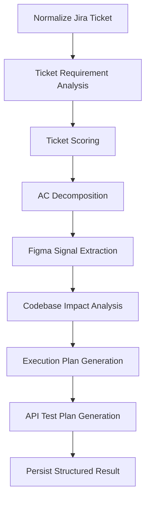

# ScopePilot 开发计划

## 1. 开发目标

### 1.1 项目目标

开发一个 SaaS 平台，帮助后端开发者和后端团队完成 Jira Sprint 需求分析、Ticket 评分、AC 后端功能拆解、代码库影响分析、开发执行计划生成和 API 测试计划生成。

### 1.2 MVP 完成标准

第一版完成后，用户可以在平台中完成以下流程：

1. 创建 workspace 和 project。
2. 配置 Jira 连接。
3. 输入 Sprint 名称或 JQL 导入 ticket。
4. 查看 Sprint 中所有 ticket。
5. 触发 AI 分析。
6. 查看 Sprint 总览、风险、待确认问题。
7. 查看每个 ticket 的评分、AC 拆解、后端功能点、执行计划和 API 测试计划。
8. 导出 Markdown / PDF 报告。
9. 切换中文和英文界面。
10. 选择中文或英文生成报告。

MVP 不做：

- 不自动修改代码。
- 不自动提交 PR。
- 不自动回写 Jira comment。
- 不做完整项目管理系统。
- 不强依赖 Figma 深度解析。

## 2. 技术选型

### 2.1 推荐技术栈

Frontend：

- Next.js。
- React。
- TypeScript。
- Tailwind CSS。
- shadcn/ui。
- TanStack Query。
- next-intl。

Backend：

- FastAPI。
- Python 3.12+。
- SQLAlchemy 2.x。
- Alembic。
- Pydantic。
- Celery。
- Redis。
- PostgreSQL。

AI：

- Provider 抽象层。
- OpenAI / Anthropic / Gemini 可切换。
- 第一版先实现一个 provider。
- 第一版不引入 LangGraph、CrewAI 等复杂多 Agent 框架。
- 先使用普通 service pipeline，每一步使用明确函数和 JSON schema。

Local Agent：

- 第一阶段先做 Python CLI。
- CLI 使用 Typer 和 rich。
- 后续再做桌面应用。
- CLI 负责扫描本地代码库并上传结构化索引摘要。

部署：

- Docker Compose 起步。
- 后续根据客户规模再考虑 Kubernetes、ECS、Render、Fly.io 或 Railway。

### 2.2 推荐仓库结构

```text
scopepilot/
  apps/
    web/
    api/
    local-agent/
  packages/
    shared/
      schemas/
      i18n/
  docs/
    product/
    api/
    architecture/
```

## 3. 界面设计

### 3.1 信息架构

```text
Login
Workspace
  Dashboard
  Projects
    Project Detail
      Overview
      Integrations
      Codebase
      Sprints
        Sprint Detail
          Overview
          Tickets
          Risk Map
          Execution Plan
          API Test Plan
          Open Questions
```

### 3.2 核心页面

#### 3.2.1 登录页

目标：

- 支持邮箱登录。
- 后续支持 Google / GitHub SSO。

主要组件：

- 登录表单。
- 语言切换。
- 错误提示。

#### 3.2.2 Workspace Dashboard

目标：

- 展示当前 workspace 的项目、最近分析的 sprint、使用额度。

主要区域：

- Project 列表。
- 最近 Sprint Analysis。
- 本月使用量。
- 快捷入口：导入 Sprint。

#### 3.2.3 Project Settings

目标：

- 配置 Jira、Figma、代码库和报告语言。

主要 Tab：

- General。
- Jira。
- Figma。
- Codebase。
- Report Settings。

Codebase 设置：

```text
Codebase Source
  - Cloud Repository
  - Local Project

Cloud Repository
  - GitHub
  - GitLab
  - Bitbucket

Local Project
  - 安装 Local Agent
  - 复制连接命令
  - 查看最近同步状态
```

#### 3.2.4 Sprint Import

目标：

- 输入 Sprint 名称或 JQL。
- 预览导入的 tickets。
- 选择报告语言。
- 触发分析。

字段：

- Sprint name。
- JQL。
- Project。
- Report language：中文 / English。
- Include Figma：开关。
- Include Codebase Impact：开关。
- Include API Test Plan：开关。

#### 3.2.5 Sprint Detail

目标：

- 展示一次 Sprint 分析的总体结果。

布局：

```text
Header
  Sprint name
  Analysis status
  Report language
  Export buttons

Summary cards
  Total tickets
  High risk tickets
  Missing AC tickets
  Open questions

Tabs
  Overview
  Tickets
  Risk Map
  Execution Plan
  API Test Plan
  Open Questions
```

#### 3.2.6 Ticket Detail

目标：

- 展示单个 ticket 的详细分析。

布局：

```text
Left panel
  Jira summary
  Description
  Acceptance Criteria
  Figma links

Right panel
  Score
  Backend Features
  Code Impact
  Execution Plan
  API Tests
  Open Questions
```

### 3.3 UI 状态设计

需要覆盖以下状态：

- Empty：尚未导入 Sprint。
- Loading：正在拉取 Jira ticket。
- Analyzing：AI 分析中。
- Partial：部分 ticket 分析失败。
- Completed：分析完成。
- Failed：整体分析失败。
- No Permission：Jira 或代码库权限不足。
- Rate Limited：额度不足。

## 4. 前端渲染设计

### 4.1 前端数据获取

使用 TanStack Query：

- `useWorkspaces`
- `useProjects`
- `useSprint`
- `useSprintTickets`
- `useAnalysisJob`
- `useTicketAnalysis`

轮询策略：

- 分析任务运行中，每 3-5 秒轮询 job 状态。
- 完成后停止轮询。
- 后续可升级为 WebSocket / SSE。

### 4.2 报告渲染

报告不要只存 Markdown。后端应返回结构化 JSON，前端按模块渲染：

```text
SprintSummaryCard
TicketScoreBadge
RiskLevelBadge
OpenQuestionList
BackendFeatureList
CodeImpactPanel
ExecutionPlanTimeline
ApiTestCaseTable
MarkdownExportButton
PdfExportButton
```

### 4.3 国际化设计

UI 文案：

```text
apps/web/messages/
  zh-CN.json
  en-US.json
```

用户语言优先级：

1. 用户个人设置。
2. Workspace 默认语言。
3. 浏览器语言。
4. 默认中文。

报告语言：

- 与 UI 语言解耦。
- 单次分析可选择中文或英文。
- 同一个 sprint 后续可以重新生成另一种语言的报告。

### 4.4 前端路由建议

```text
/login
/workspaces
/workspaces/:workspaceId
/workspaces/:workspaceId/projects
/workspaces/:workspaceId/projects/:projectId
/workspaces/:workspaceId/projects/:projectId/settings
/workspaces/:workspaceId/projects/:projectId/sprints/import
/workspaces/:workspaceId/projects/:projectId/sprints/:sprintId
/workspaces/:workspaceId/projects/:projectId/sprints/:sprintId/tickets/:ticketId
```

## 5. 后端架构

### 5.1 服务模块

```text
api/
  auth/
  workspaces/
  projects/
  integrations/
  jira/
  sprints/
  tickets/
  analyses/
  codebase/
  figma/
  reports/
  billing/
  i18n/
```

### 5.2 后端分层

```text
Router
  -> Service
    -> Repository
      -> Database

Worker
  -> Analysis Pipeline
    -> AI Provider
    -> Database
```

### 5.3 异步任务

分析任务必须异步：

- Jira 导入。
- Sprint 分析。
- Ticket 分析。
- Figma 解析。
- Codebase 影响分析。
- Report 生成。

任务状态：

```text
pending
running
completed
failed
cancelled
```

任务结构：

```json
{
  "id": "job_123",
  "type": "sprint_analysis",
  "status": "running",
  "progress": 42,
  "message": "Analyzing ticket LPRO-123",
  "error": null
}
```

### 5.4 AI Pipeline



Pipeline 设计原则：

- 每一步独立保存结果。
- 每一步都可以重试。
- 每一步都使用 JSON schema 校验。
- AI 推断内容必须标注 confidence。
- 不确定内容放入 open_questions。

## 6. 数据库设计

### 6.1 核心表

```text
users
workspaces
workspace_members
projects
integrations
sprints
tickets
ticket_analyses
sprint_analyses
analysis_jobs
codebase_sources
codebase_indexes
figma_artifacts
api_test_plans
report_exports
usage_records
```

### 6.2 关键字段

#### projects

```text
id
workspace_id
name
key
default_language
default_report_language
created_at
updated_at
```

#### integrations

```text
id
workspace_id
project_id
provider
type
encrypted_credentials
status
created_at
updated_at
```

#### tickets

```text
id
sprint_id
jira_key
summary
description
acceptance_criteria
figma_links
status
assignee
story_points
raw_payload
created_at
updated_at
```

#### ticket_analyses

```text
id
ticket_id
language
business_goal
score_json
backend_features_json
code_impact_json
execution_plan_json
api_tests_json
open_questions_json
confidence
created_at
updated_at
```

#### codebase_sources

```text
id
project_id
source_type
provider
repo_url
local_agent_id
last_indexed_at
status
```

source_type：

```text
cloud_repo
local_agent
```

## 7. API 设计

### 7.1 Workspace API

```http
GET /api/workspaces
POST /api/workspaces
GET /api/workspaces/{workspace_id}
PATCH /api/workspaces/{workspace_id}
```

### 7.2 Project API

```http
GET /api/workspaces/{workspace_id}/projects
POST /api/workspaces/{workspace_id}/projects
GET /api/projects/{project_id}
PATCH /api/projects/{project_id}
```

### 7.3 Integration API

```http
POST /api/projects/{project_id}/integrations/jira
GET /api/projects/{project_id}/integrations
DELETE /api/integrations/{integration_id}
POST /api/integrations/{integration_id}/test
```

### 7.4 Sprint API

```http
POST /api/projects/{project_id}/sprints/import
GET /api/projects/{project_id}/sprints
GET /api/sprints/{sprint_id}
POST /api/sprints/{sprint_id}/analyze
GET /api/sprints/{sprint_id}/summary
GET /api/sprints/{sprint_id}/tickets
```

导入请求：

```json
{
  "sprint_name": "LPRO Sprint 0707",
  "jql": null,
  "report_language": "zh-CN",
  "include_figma": true,
  "include_codebase": true,
  "include_api_tests": true
}
```

### 7.5 Ticket API

```http
GET /api/tickets/{ticket_id}
GET /api/tickets/{ticket_id}/analysis
POST /api/tickets/{ticket_id}/analyze
```

### 7.6 Analysis Job API

```http
GET /api/jobs/{job_id}
POST /api/jobs/{job_id}/cancel
```

### 7.7 Codebase API

```http
POST /api/projects/{project_id}/codebase/sources
GET /api/projects/{project_id}/codebase/sources
POST /api/codebase/sources/{source_id}/index
GET /api/codebase/sources/{source_id}/index-status
POST /api/local-agent/register
POST /api/local-agent/{agent_id}/sync-index
```

Local Agent 同步示例：

```json
{
  "project_id": "proj_123",
  "root_name": "backend-service",
  "commit_sha": "abc123",
  "files": [
    {
      "path": "src/order/order.controller.ts",
      "language": "typescript",
      "symbols": ["OrderController", "getOrders", "exportOrders"],
      "routes": ["GET /orders", "GET /orders/export"]
    }
  ]
}
```

### 7.8 Report API

```http
GET /api/sprints/{sprint_id}/report
POST /api/sprints/{sprint_id}/report/export
GET /api/report-exports/{export_id}
```

导出格式：

```json
{
  "format": "markdown",
  "language": "zh-CN"
}
```

## 8. Local Agent 设计

### 8.1 第一版 CLI 命令

```bash
scopepilot login
scopepilot connect-local "F:\Projects\backend-service"
scopepilot index
scopepilot sync
```

### 8.2 扫描内容

默认扫描：

- 文件路径。
- 语言。
- 类名、函数名、方法名。
- API route。
- OpenAPI 文件。
- 数据库 migration。
- package 信息。

默认不上传：

- 完整源码。
- `.env`。
- secrets。
- node_modules。
- build output。
- 大型二进制文件。

### 8.3 本地扫描输出

```json
{
  "project_name": "backend-service",
  "languages": ["typescript"],
  "frameworks": ["nestjs"],
  "routes": [
    {
      "method": "GET",
      "path": "/orders",
      "file": "src/order/order.controller.ts",
      "handler": "OrderController.getOrders"
    }
  ],
  "modules": [
    {
      "name": "OrderModule",
      "files": [
        "src/order/order.controller.ts",
        "src/order/order.service.ts"
      ]
    }
  ]
}
```

## 9. 测试场景和用例

### 9.1 不自动生成测试文件的原则

当前阶段只整理测试场景和用例，不自动生成测试文件，也不自动运行测试。实际测试执行由开发者决定。

### 9.2 前端测试场景

| 场景 | 前置条件 | 操作 | 预期结果 |
|---|---|---|---|
| 切换语言 | 用户在任意页面 | 切换中文/英文 | UI 文案立即切换 |
| 导入 Sprint | Jira 已配置 | 输入 Sprint 名称并提交 | 创建导入任务并显示进度 |
| 查看分析中状态 | 分析任务 running | 打开 Sprint Detail | 显示分析进度和当前步骤 |
| 查看失败状态 | 分析任务 failed | 打开 Sprint Detail | 显示错误原因和重试按钮 |
| 查看 Ticket 分析 | 分析完成 | 点击 ticket | 展示评分、功能点、计划、测试用例 |
| 导出报告 | 分析完成 | 点击导出 Markdown | 下载报告文件 |
| 权限不足 | 非项目成员访问 | 打开项目页面 | 返回无权限页面 |

### 9.3 后端接口测试场景

| 接口 | 场景 | 预期 |
|---|---|---|
| `POST /api/projects/{project_id}/sprints/import` | 正常导入 | 返回 sprint 和 job_id |
| `POST /api/projects/{project_id}/sprints/import` | Jira 未配置 | 返回 400 |
| `POST /api/projects/{project_id}/sprints/import` | Sprint 不存在 | 返回 404 或业务错误 |
| `POST /api/sprints/{sprint_id}/analyze` | 正常触发分析 | 返回 job_id |
| `POST /api/sprints/{sprint_id}/analyze` | 重复触发 | 返回已有 running job |
| `GET /api/jobs/{job_id}` | 查询任务 | 返回状态、进度、错误 |
| `GET /api/tickets/{ticket_id}/analysis` | 分析完成 | 返回结构化分析结果 |
| `GET /api/tickets/{ticket_id}/analysis` | 未分析 | 返回 404 或 empty 状态 |
| `POST /api/local-agent/{agent_id}/sync-index` | 正常同步索引 | 返回同步成功 |
| `POST /api/local-agent/{agent_id}/sync-index` | agent 无权限 | 返回 403 |

### 9.4 AI Pipeline 测试场景

| 场景 | 输入 | 预期 |
|---|---|---|
| AC 完整 | ticket 有清晰 AC | 输出 backend_features 和 api_tests |
| AC 缺失 | ticket 无 AC | 输出 open_questions，不编造规则 |
| Figma 链接存在 | ticket 有 Figma URL | 记录 figma_artifacts 或待解析状态 |
| 代码库未连接 | include_codebase=true 但未配置 | 跳过 code impact 并提示配置缺失 |
| AI 返回非法 JSON | provider 返回格式错误 | 自动重试或标记步骤失败 |
| 部分 ticket 失败 | sprint 中 1 个 ticket 分析失败 | sprint 状态为 partial，其他 ticket 可查看 |

### 9.5 安全测试场景

| 场景 | 预期 |
|---|---|
| 用户访问其他 workspace 的 project | 返回 403 |
| Jira token 失效 | 集成状态变为 invalid |
| Local Agent 上传 `.env` 路径 | 后端拒绝或过滤 |
| 超出分析额度 | 返回 quota exceeded |
| 导出他人报告 | 返回 403 |

### 9.6 API 测试计划生成用例

示例 ticket：

```text
用户可以导出订单列表。
AC:
1. 有订单导出权限的用户可以导出当前筛选结果。
2. 没有权限的用户不能导出。
3. 当筛选结果为空时，导出空 CSV。
```

预期生成测试计划：

```json
[
  {
    "name": "有权限用户导出订单成功",
    "method": "GET",
    "path": "/orders/export",
    "expected_status": 200,
    "assertions": [
      "Content-Type 为 text/csv",
      "导出内容符合筛选条件"
    ]
  },
  {
    "name": "无权限用户导出订单失败",
    "method": "GET",
    "path": "/orders/export",
    "expected_status": 403
  },
  {
    "name": "空筛选结果导出空 CSV",
    "method": "GET",
    "path": "/orders/export",
    "expected_status": 200,
    "assertions": [
      "CSV 表头存在",
      "数据行为空"
    ]
  }
]
```

## 10. 开发里程碑

### Milestone 1：基础平台

目标：

- 完成登录、workspace、project、基础 UI。

交付：

- Web 框架。
- API 框架。
- PostgreSQL schema。
- i18n 基础能力。

### Milestone 2：Jira Sprint 导入

目标：

- 支持从 Jira 导入 Sprint tickets。

交付：

- Jira integration。
- Sprint import API。
- Ticket 列表页。
- Import job 状态。

### Milestone 3：AI Ticket 分析

目标：

- 支持单 ticket 和 sprint 级别分析。

交付：

- Ticket analysis pipeline。
- Ticket scoring。
- AC decomposition。
- Ticket Detail 页面。

### Milestone 4：Sprint 报告

目标：

- 支持 Sprint 总览、风险图、开放问题和导出。

交付：

- Sprint Detail。
- Risk Map。
- Report Export。
- 中文/英文报告生成。

### Milestone 5：Codebase 分析

目标：

- 支持云端仓库或本地项目索引。

交付：

- Codebase source 设置。
- Local Agent CLI 初版。
- Code impact panel。

### Milestone 6：API 测试计划

目标：

- 根据 AC 和后端功能点生成 API 测试计划。

交付：

- API Test Plan 页面。
- Ticket API Tests。
- Sprint-level API Test Summary。

## 11. 第一阶段开发顺序

建议先按以下顺序执行：

1. 建立 monorepo。
2. 建立数据库 schema。
3. 实现登录和 workspace。
4. 实现 project。
5. 实现 Jira 集成配置。
6. 实现 Sprint 导入。
7. 实现 Ticket 列表和详情。
8. 实现 AI 分析任务。
9. 实现 Sprint 分析页面。
10. 实现报告导出。
11. 实现中英文切换。
12. 实现 Codebase source 配置。
13. 实现 Local Agent CLI 初版。

## 12. 验收清单

MVP 验收时，至少满足：

- 可以创建 workspace 和 project。
- 可以配置 Jira。
- 可以导入一个真实 Sprint。
- 可以看到所有 ticket。
- 可以触发分析并查看任务进度。
- 每个 ticket 都有结构化分析结果。
- Sprint 有总览、风险、开放问题。
- 报告支持中文和英文。
- 报告可以导出。
- 代码库未配置时，系统有清晰提示。
- 本地项目模式有明确的 CLI 接入流程。
